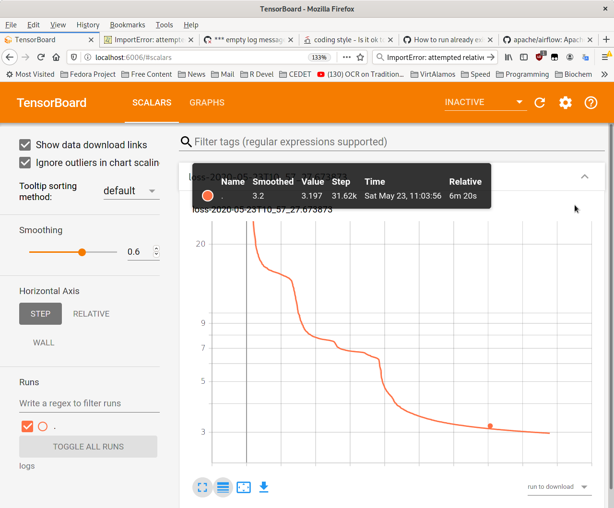

# DeductronCode
Computer codes accompanying the paper "Deductron - A Recurrent Neural Network".
We provided a minimalistic implementation in pure Python,
along with an advanced implementation utilizing Tensorflow and Keras.
This code is lightly tested should not be used in any "production" system without
further testing.

To run several programs exercising the package functionality, all one
needs to do is run the script:

`python3 run.py`

Alternatively, one can test the code by running pytest, e.g.:

`pytest-3.7`

# Pure Python Deductron implementation
In this folder one finds a pure Python implementation of the Deductron RNN.
The learning scheme is discrete state space optimization.
The particular optimization scheme is Metropolis-Hastings.

# Deductron implementation using Tensorflow
In file deductron_tf.py there is a Python script implementing Deductron RNN
through Tensorflow. This folder has a single script.

The run of the script run.py leaves the Tenslorflow logs in folder
logs, which can be analyzed with Tensorboard. Note that Tensorboard
can be also run interactively on one's computer. Tensorboard starts a
Web server which is used to observe the logs, and it produces a
canonical graph of the loss function. This is the way to track
learning progress.

# Tensorflow version 2 supported
The early versions of this code were written for Tensorflow v.1 and they can
be found on the web.

The current version is updated to work with Tensorflow v.2. However, we use
it in compatibility mode with v.1. In principle, one should be able to go
to v.1 quite easily by modifying the top of the script.
